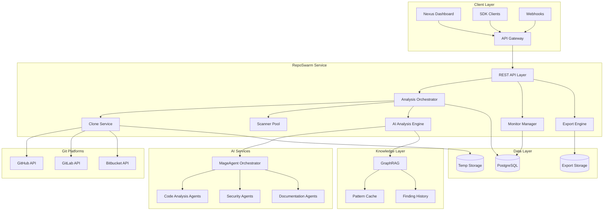
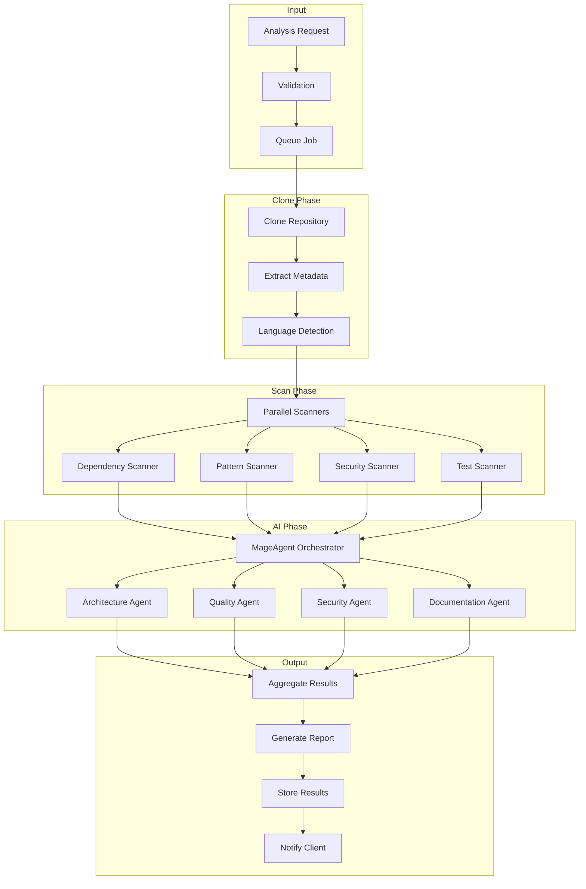
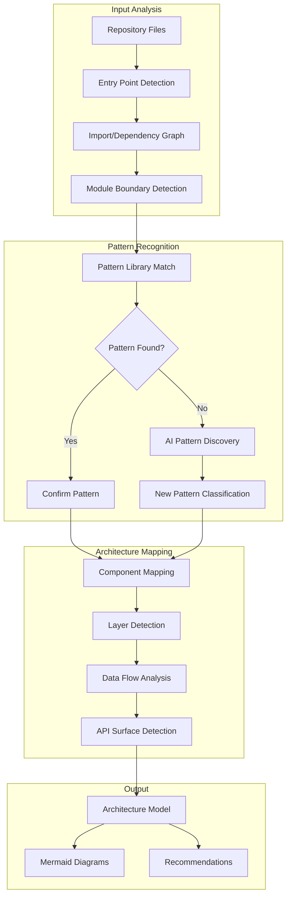
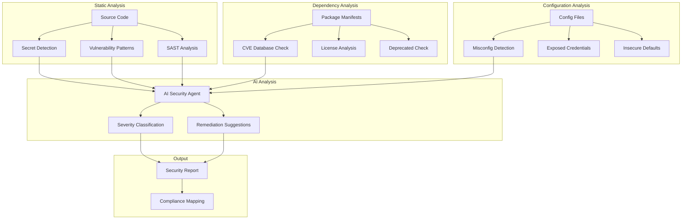
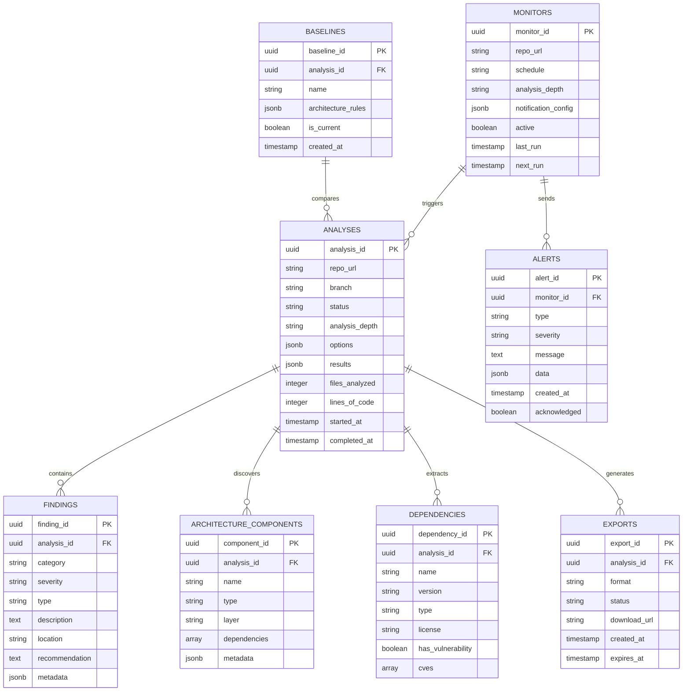
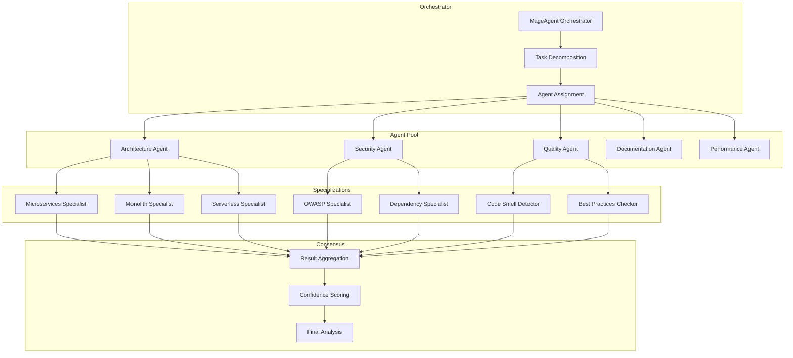
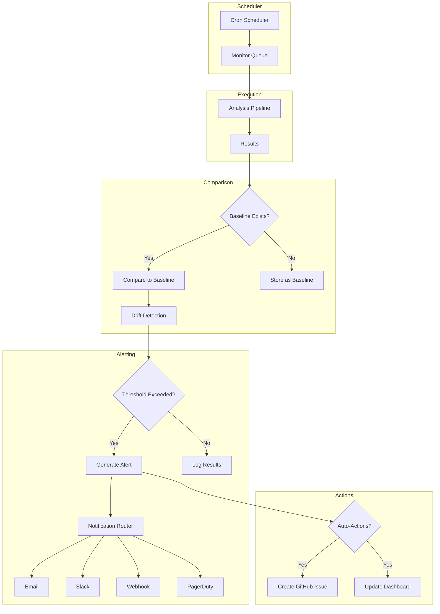
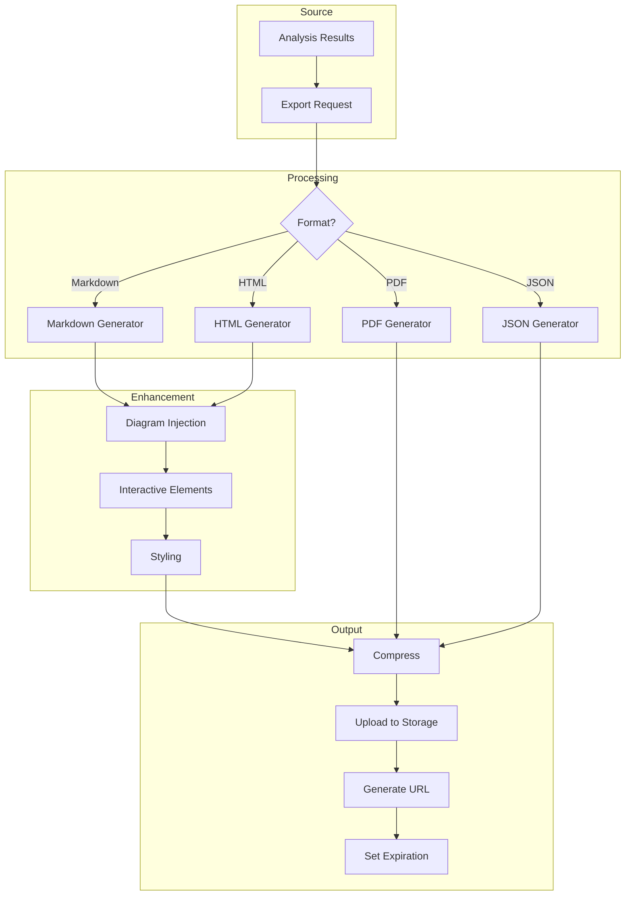

# RepoSwarm Architecture

Technical architecture and system design for AI-powered repository analysis.

---

## System Overview



---

## Core Components

### 1. REST API Layer

| Endpoint | Method | Description |
|----------|--------|-------------|
| `/api/v1/reposwarm/analyze` | POST | Start repository analysis |
| `/api/v1/reposwarm/analysis/:analysisId` | GET | Get analysis result |
| `/api/v1/reposwarm/analyze/batch` | POST | Batch analysis |
| `/api/v1/reposwarm/history` | GET | Get analysis history |
| `/api/v1/reposwarm/export/:analysisId` | GET | Export analysis |
| `/api/v1/reposwarm/compare` | GET | Compare analyses |
| `/api/v1/reposwarm/monitors` | POST | Create monitor |
| `/api/v1/reposwarm/monitors` | GET | List monitors |
| `/api/v1/reposwarm/monitors/:monitorId` | PATCH | Update monitor |
| `/api/v1/reposwarm/monitors/:monitorId` | DELETE | Delete monitor |
| `/api/v1/reposwarm/webhooks` | POST | Register webhook |
| `/api/v1/reposwarm/webhooks` | GET | List webhooks |

### 2. Analysis Orchestrator

Coordinates the multi-stage analysis pipeline.

**Capabilities:**
- Job queuing and prioritization
- Progress tracking
- Timeout management
- Error recovery

### 3. Clone Service

Handles repository cloning with platform-specific authentication.

**Supported Platforms:**
- GitHub (cloud and enterprise)
- GitLab (cloud and self-hosted)
- Bitbucket (cloud and server)

### 4. Scanner Pool

Parallel code scanning for different analysis types.

**Scanner Types:**
- Language detection
- Dependency extraction
- Pattern recognition
- Security scanning
- Test coverage analysis

### 5. AI Analysis Engine

Multi-agent AI analysis using MageAgent.

**Agent Types:**
- Architecture discovery agents
- Code quality agents
- Security vulnerability agents
- Documentation analysis agents
- Recommendation agents

### 6. Monitor Manager

Continuous repository monitoring.

**Features:**
- Scheduled analysis
- Change detection
- Alert management
- Webhook notifications

### 7. Export Engine

Multi-format report generation.

**Formats:**
- Markdown
- HTML (interactive)
- PDF
- JSON

---

## Analysis Pipeline



---

## Architecture Discovery Engine



---

## Security Scanning Pipeline



---

## Data Model



---

## Multi-Agent Analysis System



---

## Continuous Monitoring Architecture



---

## Export Pipeline



---

## Security Model

### Authentication
- Bearer token via Nexus API Gateway
- Git platform tokens (encrypted storage)
- Webhook signature verification

### Authorization
- Analysis-level access control
- Organization scoping
- Monitor ownership

### Data Protection
- Repositories cloned to ephemeral storage
- Results encrypted at rest
- No source code retention beyond analysis
- Audit logging for all operations

---

## Deployment Architecture

### Kubernetes Configuration

```yaml
apiVersion: apps/v1
kind: Deployment
metadata:
  name: nexus-reposwarm
  namespace: nexus-plugins
spec:
  replicas: 3
  selector:
    matchLabels:
      app: nexus-reposwarm
  template:
    spec:
      containers:
      - name: reposwarm-api
        image: adverant/nexus-reposwarm:1.0.0
        ports:
        - containerPort: 8080
        resources:
          requests:
            memory: "1Gi"
            cpu: "500m"
          limits:
            memory: "2Gi"
            cpu: "1000m"
        env:
        - name: GITHUB_APP_ID
          valueFrom:
            secretKeyRef:
              name: reposwarm-secrets
              key: github-app-id
        volumeMounts:
        - name: temp-storage
          mountPath: /tmp/repos
        livenessProbe:
          httpGet:
            path: /live
            port: 8080
        readinessProbe:
          httpGet:
            path: /ready
            port: 8080
      volumes:
      - name: temp-storage
        emptyDir:
          sizeLimit: 10Gi
```

### Resource Allocation

| Component | CPU | Memory | Storage |
|-----------|-----|--------|---------|
| API Server | 500m-1000m | 1Gi-2Gi | - |
| Analysis Worker | 1000m-2000m | 2Gi-4Gi | 10Gi (ephemeral) |
| Clone Worker | 250m-500m | 512Mi-1Gi | 10Gi (ephemeral) |
| Export Worker | 500m-1000m | 1Gi-2Gi | 5Gi |

---

## Performance

### Analysis Capacity

| Tier | Concurrent Analyses | Max Repo Size | Files/Analysis |
|------|---------------------|---------------|----------------|
| Free | 1 | 50MB | 500 |
| Starter | 3 | 500MB | 2,000 |
| Professional | 5 | 2GB | 10,000 |
| Enterprise | Custom | Unlimited | Unlimited |

### Latency Targets

| Operation | Target |
|-----------|--------|
| Quick Analysis | < 2 min |
| Standard Analysis | < 10 min |
| Deep Analysis | < 30 min |
| Export Generation | < 60s |
| Monitor Check | < 5 min |

---

## Monitoring

### Metrics (Prometheus)

```
# Analysis metrics
reposwarm_analyses_total
reposwarm_analysis_duration_seconds
reposwarm_files_analyzed_total
reposwarm_lines_analyzed_total

# Security metrics
reposwarm_findings_total{severity="critical|high|medium|low"}
reposwarm_vulnerabilities_detected_total

# Monitor metrics
reposwarm_monitors_active
reposwarm_alerts_sent_total

# Performance metrics
reposwarm_clone_duration_seconds
reposwarm_scanner_duration_seconds
reposwarm_ai_analysis_duration_seconds
```

### Alerting

| Alert | Condition | Severity |
|-------|-----------|----------|
| Analysis Failure | > 5% failure rate | Critical |
| Clone Timeout | > 3 consecutive timeouts | Warning |
| Queue Backup | > 50 pending jobs | Warning |
| AI Agent Failure | Agent unreachable | Critical |

---

## Next Steps

- [Quick Start Guide](./QUICKSTART.md) - Get started quickly
- [Use Cases](./USE-CASES.md) - Analysis scenarios
- [API Reference](./docs/api-reference/endpoints.md) - Complete docs

